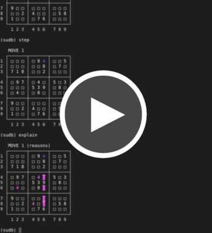

sudb
====

sudb is a 9x9 Sudoku solver that can solve puzzles automatically or
interactively using GDB-style commands to query or control the solver.
Puzzles can be entered row by row, imported from text or image files, or
generated from a random seed. These puzzles can also be made harder by
removing unnecessary clues or easier by adding in clues that seem to
require guessing.


Demo
----
<a href="screenshots/sudb_demo.mp4"></a>


Installing
----------
```shell
# clone the repository
$ git clone https://github.com/HunterBaines/sudb.git

# change into the project's root directory
$ cd sudb/

# install the sudb package and copy the script 
# invoking its main method into your PATH
$ sudo python setup.py install
```

To test that everything worked, try this:

```shell
$ sudb --auto --difference --file https://projecteuler.net/project/resources/p096_sudoku.txt
```

(The `--auto` option tells the program to solve the puzzles without
interaction; `--difference` tells it to colorize the cells in the solved
puzzles it outputs that were originally blank.)

To import from images, a few additional steps are required. First, install
the packages needed to preprocess and manipulate the images using one of
the following commands, for example:

```shell
# using the Python package manager pip:
$ sudo pip install numpy scipy pillow

# using the default package manager on Debian/Ubuntu:
$ sudo apt install python-numpy python-scipy python-imaging
```

Then install the OCR engine used to recognize digits in the images and the
Python wrapper for that engine:

```shell
$ sudo apt install tesseract-ocr
$ sudo pip install pytesseract
```


Importing
---------
To enter lines manually via stdin, invoke sudb without an import option
(e.g., `--lines`, `--file`, or `--random`). Each puzzle entered this way
should specify one row of the puzzle per line with 0 or any non-numeric,
non-whitespace character used for blank cells. Here is an example using '0'
as the character representing blanks:

```
100624008
360700520
400000009
000207000
000000037
030180090
209310000
000006100
070000000
```

The option `--lines LINE1 LINE2 ...` imports a Sudoku from the nine rows of
the puzzle passed to it as arguments (using the puzzle format just
described). One could import the above puzzle using this:

```shell
$ sudb --lines 100624008 360700520 400000009 000207000 000000037 030180090 209310000 000006100 070000000
```

The option `--file FILENAME` imports puzzles from text or image files (or
URLs to either). Text files should follow the same format described above.
Multiple puzzles may be included in the same file, and the importer will do
its best to ignore lines that don't appear to part of the puzzles. Image
files should be cleanly cropped to the border of the puzzle with sharp text
and a high-contrast grid for best results---and even then the importer may
miss clues. Importing from images requires numpy, scipy, PIL, and
pytesseract.

The option `--random [SEED]` generates a puzzle given one or more integer
seeds (or from a random seed if none is given).


Interacting
-----------
sudb defaults to an interactive mode in which one controls the solver using
an interface and commands modeled after the GNU Debugger. This is a brief
overview of some of those commands. To try them out, import a puzzle without
using `--auto` (`sudb --random 1979` will work just fine).

Note that all commands can be shortened if doing so causes no ambiguity. 


### Basic Commands ###
* `help` displays a list of all commands, and `help COMMAND` gives a brief
  description of what COMMAND does and how to use it.

* `quit` exits the session associated with the current puzzle (though not
  necessarily the program itself if any puzzles are left to be solved).

* `print` prints the current state of the puzzle board.


### Commands for Controlling the Solver ###
* `step` (or `s`) moves the solver one clue forward. You can also use something
  like `step 3` or `step 10` to move the solver a specified number of steps
  forward. Clues deduced via `step` come in a relatively arbitrary (though
  generally left-to-right) order; to focus effort on a particular row,
  column, or box in the puzzle, the step variants `stepr ROW`, `stepc
  COLUMN`, or `stepb BOX`, respectively, can be used.

* `finish` steps until the puzzle is solved or the solver is at a breakpoint.

* `break ROW COLUMN` sets a breakpoint at the given row and column in the
  puzzle, which will force the solver to pause itself if it discovers the number
  that goes in the cell at that row and column. (Breakpoints can be listed via
  `info breakpoint`.)

* `x ROW COLUMN` lists all candidates the solver is currently entertaining for
  the cell at the given location. (The command `print candidates` does the same
  but inline and for all cells.)

* `explain` indicates how the solver deduced the previous move.


### Commands for Playing Along ###
* `stepm ROW COLUMN NUMBER` (or `sm ROW COLUMN NUMBER` or simply `ROW COLUMN
  NUMBER`) sets the value at the cell specified by (ROW, COLUMN) to NUMBER.

* `unstep` undoes the last step (whether made via `step` or `stepm`).

* `checkpoint LABEL` saves the board state under the given LABEL, which can be
  returned to using `restart LABEL`. (Checkpoints can be listed via `info
  checkpoint`, and `print checkpoint LABEL` displays the state of the board at
  the given LABEL with differences between it and the current state noted.)

* `mark ROW COLUMN NUMBER` stores NUMBER as a candidate for the cell at the
  given location. This collection of candidates is kept separate from the
  solver's.

* `info mark ROW COLUMN` lists all user-defined candidates at the given
  location. (The command `print marks` does the same but inline and for all
  cells.)

